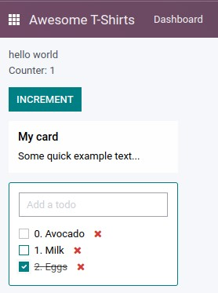
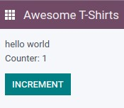
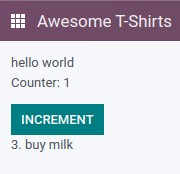
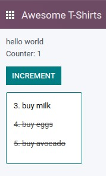
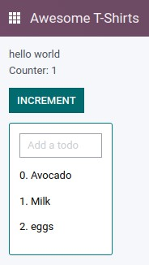
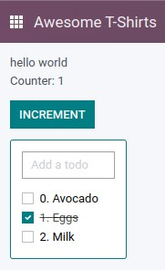
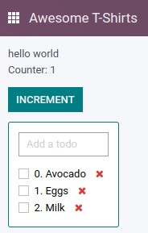
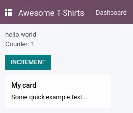

# Part 1: Owl Framework 🦉

Components are the basic UI building blocks in Odoo. Odoo components are made
with the Owl framework, which is a component system custom made for Odoo.

Let us take some time to get used to Owl itself. The exercises in this section
may be artificial, but their purpose is to understand and practice the basic
notions of Owl quickly



## 1.1 A `Counter` Component

Let us see first how to create a sub component.

- Extract the `counter` code from the `AwesomeDashboard` component into a new
  component `Counter`.
- You can do it in the same file first, but once it's done, update your code to
  move the `Counter` in its own file. (don't forget the `/** @odoo-module **/`)
- also, make sure the template is in its own file, with the same name.

<details>
  <summary><b>Preview</b></summary>



</details>

<details>
  <summary><b>Resources</b></summary>

- [owl: github repository](https://github.com/odoo/owl)
- [owl: documentation](https://github.com/odoo/owl#documentation)
- [owl: using sub components](https://github.com/odoo/owl/blob/master/doc/reference/component.md#sub-components)
- [odoo: documentation on assets](https://www.odoo.com/documentation/master/developer/reference/frontend/assets.html)

</details>

## 1.2 A `Todo` Component

We will modify the `AwesomeDashboard` component to keep track of a list of todos.
This will be done incrementally in multiple exercises, that will introduce
various concepts.

First, let's create a `Todo` component that display a task, which is described by an id (number), a description (string), and a status `done` (boolean). For
example:

```js
{ id: 3, description: "buy milk", done: false }
```

- create a `Todo` component that receive a `todo` in props, and display it: it
  should show something like `3. buy milk`
- also, add the bootstrap classes `text-muted` and `text-decoration-line-through` on the task if it is done
- modify `AwesomeDashboard` to display a `Todo` component, with some hardcoded
  props to test it first. For example:
  ```js
    setup() {
        ...
        this.todo = { id: 3, description: "buy milk", done: false };
    }
  ```

<details>
  <summary><b>Preview</b></summary>



</details>

<details>
  <summary><b>Resources</b></summary>

- [owl: props](https://github.com/odoo/owl/blob/master/doc/reference/props.md)
- [owl: Dynamic attributes](https://github.com/odoo/owl/blob/master/doc/reference/templates.md#dynamic-attributes)
- [owl: Dynamic class attributes](https://github.com/odoo/owl/blob/master/doc/reference/templates.md#dynamic-class-attribute)

</details>

## 1.3 Props Validation

The `Todo` component has an implicit API: it expects to receive in its props the
description of a todo in a specified format: `id`, `description` and `done`.
Let us make that API more explicit: we can add a props definition that will let
Owl perform a validation step in dev mode. It is a good practice to do that for
every component.

- Add props validation to Todo
- make sure it fails in dev mode

<details>
  <summary><b>Resources</b></summary>

- [owl: props validation](https://github.com/odoo/owl/blob/master/doc/reference/props.md#props-validation)
- [odoo: debug mode](https://www.odoo.com/documentation/master/developer/reference/frontend/framework_overview.html#debug-mode)
- [odoo: activate debug mode](https://www.odoo.com/documentation/master/applications/general/developer_mode.html#developer-mode)

</details>

## 1.4 A List of todos

Now, let us display a list of todos instead of just one todo. For now, we can
still hardcode the list.

- Change the code to display a list of todos, instead of just one, and use
  `t-foreach` in the template
- think about how it should be keyed

<details>
  <summary><b>Preview</b></summary>



</details>

<details>
  <summary><b>Resources</b></summary>

- [owl: t-foreach](https://github.com/odoo/owl/blob/master/doc/reference/templates.md#loops)

</details>

## 1.5 Adding a todo

So far, the todos in our list are hardcoded. Let us make it more useful by allowing
the user to add a todo to the list.

- add input above the task list with placeholder `Enter a new task`
- add an event handler on the `keyup` event named `addTodo`
- implement `addTodo` to check if enter was pressed (`ev.keyCode === 13`), and
  in that case, create a new todo with the current content of the input as description
- make sure it has a unique id (can be just a counter)
- then clear the input of all content
- bonus point: don't do anything if input is empty

Notice that nothing updates in the UI: this is because Owl does not know that it
should update the UI. This can be fixed by wrapping the todo list in a `useState`:

```js
this.todos = useState([]);
```

<details>
  <summary><b>Preview</b></summary>



</details>

<details>
  <summary><b>Resources</b></summary>

- [owl: reactivity](https://github.com/odoo/owl/blob/master/doc/reference/reactivity.md)

</details>

## 1.6 Focusing the input

Let's see how we can access the DOM with `t-ref`. For this exercise, we want to
focus the `input` from the previous exercise whenever the dashboard is mounted.

Bonus point: extract the code into a specialized hook `useAutofocus`

<details>
  <summary><b>Resources</b></summary>

- [owl: component lifecycle](https://github.com/odoo/owl/blob/master/doc/reference/component.md#lifecycle)
- [owl: hooks](https://github.com/odoo/owl/blob/master/doc/reference/hooks.md)
- [owl: useRef](https://github.com/odoo/owl/blob/master/doc/reference/hooks.md#useref)

</details>

## 1.7 Toggling todos

Now, let's add a new feature: mark a todo as completed. This is actually
trickier than one might think: the owner of the state is not the same as the
component that displays it. So, the `Todo` component need to communicate to its
parent that the todo state needs to be toggled. One classic way to do this is
by using a callback prop `toggleState`

- add an input of type="checkbox" before the id of the task, which is checked if
  the `done` state is true,
- add a callback props `toggleState`
- add a `click` event handler on the input in `Todo`, and make sure it calls
  the `toggleState` function with the todo id.
- make it work!

<details>
  <summary><b>Preview</b></summary>



</details>

<details>
  <summary><b>Resources</b></summary>

- [owl: binding function props](https://github.com/odoo/owl/blob/master/doc/reference/props.md#binding-function-props)

</details>

## 1.8 Deleting todos

The final touch is to let the user delete a todo.

- add a new callback prop `removeTodo`
- add a `<span class="fa fa-remove">` in the Todo component
- whenever the user clicks on it, it should call the `removeTodo` method
- make it work as expected

<details>
  <summary><b>Preview</b></summary>



</details>

## 1.9 Generic components with Slots

Owl has a powerful slot system to allow you to write generic components. This is
useful to factorize common layout between different parts of the interface.

- write a `Card` component, using the following bootstrap html structure:

  ```html
  <div class="card" style="width: 18rem;">
    
    <div class="card-body">
      <h5 class="card-title">Card title</h5>
      <p class="card-text">
        Some quick example text to build on the card title and make up the bulk
        of the card's content.
      </p>
      <a href="#" class="btn btn-primary">Go somewhere</a>
    </div>
  </div>
  ```

- this component should have two slots: one slot for the title, and one for
  the content (the default slot). For example, here is how one could use it:

  ```xml
  <Card>
    <t t-set-slot="title">Card title</t>
    <p class="card-text">Some quick example text...</p>
    <a href="#" class="btn btn-primary">Go somewhere</a>
  </Card>

  ```

- bonus point: if the `title` slot is not given, the `h5` should not be
  rendered at all

<details>
  <summary><b>Preview</b></summary>



</details>

<details>
  <summary><b>Resources</b></summary>

- [owl: slots](https://github.com/odoo/owl/blob/master/doc/reference/slots.md)
- [owl: slot props](https://github.com/odoo/owl/blob/master/doc/reference/slots.md#slots-and-props)
- [bootstrap: documentation on cards](https://getbootstrap.com/docs/5.2/components/card/)

</details>

## 1.10 Miscellaneous small tasks

- add prop validation on the Card component
- try to express in the prop validation system that it requires a `default`
  slot, and an optional `title` slot

<details>
  <summary><b>Resources</b></summary>

- [owl: props validation](https://github.com/odoo/owl/blob/master/doc/reference/props.md#props-validation)

</details>
