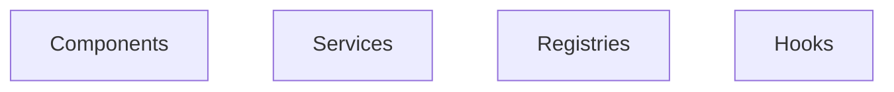
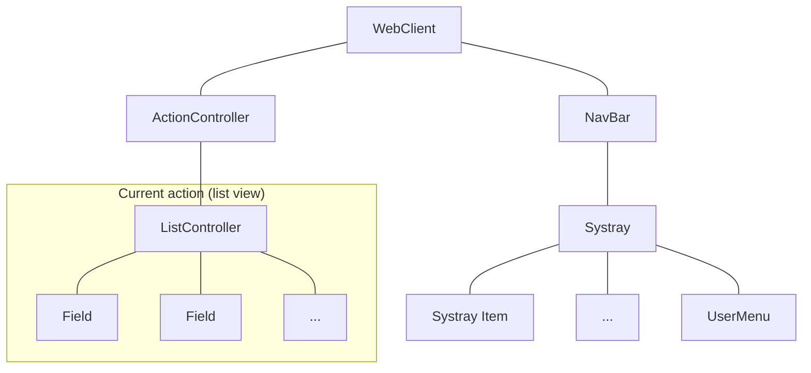
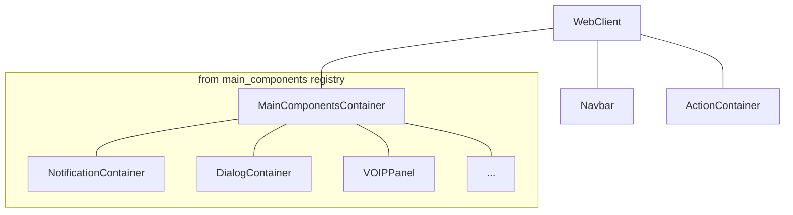

# Notes: Architecture

Let us discuss here how Odoo javascript code is designed. Roughly speaking,
all features are made with a combination of components, services, registries,
hooks or helper/utility functions.



## Component Tree

From a very high level stand point, the javascript code defines a (dynamic) tree
of components. For example, with an active list view, it might look like this:



In this case, if the user clicks on a record, it may open a form view, and the
content of the current action would be replaced with a form view. The, switching
a notebook tab would destroy the content of the previous tab, and render the
new content.

This is how Owl applications work: the visible components are displayed, updated,
and replaced with other components, depending on the user actions.

## Services

Documentation: [services](https://www.odoo.com/documentation/master/developer/reference/frontend/services.html)

In practice, every component (except the root component) may be destroyed at
any time and replaced (or not) with another component. This means that each
component internal state is not persistent. This is fine in many cases, but there
certainly are situations where we want to keep some data around. For example,
all discuss messages, or the current menu.

Also, it may happen that we need to write some code that is not a component.
Maybe something that process all barcodes, or that manages the user configuration
(context, ...).

The Odoo framework defines the notion of `service`, which is a persistent piece
of code that exports state and/or functions. Each service can depend on other
services, and components can import a service.

The following example registers a simple service that displays a notification every 5 seconds:

```js
import { registry } from "@web/core/registry";

const myService = {
  dependencies: ["notification"],
  start(env, { notification }) {
    let counter = 1;
    setInterval(() => {
      notification.add(`Tick Tock ${counter++}`);
    }, 5000);
  },
};

registry.category("services").add("myService", myService);
```

Note that services are registered in a `registry`. See below for more on that.

Services can be accessed by any component. Imagine that we have a service to
maintain some shared state:

```js
import { registry } from "@web/core/registry";

const sharedStateService = {
  start(env) {
    let state = {};

    return {
      getValue(key) {
        return state[key];
      },
      setValue(key, value) {
        state[key] = value;
      },
    };
  },
};

registry.category("services").add("shared_state", sharedStateService);
```

Then, any component can do this:

```js
import { useService } from "@web/core/utils/hooks";

setup() {
    this.sharedState = useService("shared_state");
    const value = this.sharedState.getValue("somekey");
    // do something with value
}
```

## Registries

Documentation: [registries](https://www.odoo.com/documentation/master/developer/reference/frontend/registries.html)

Registries are central to the code architecture: they maintain a collection of
key/value pairs, that are used in many places to read some information. This is
the main way to extend or customize the web client.

For example, a common usecase is to register a field or a view in a registry,
then add the information in a view arch xml, so the web client will know what
it should use.

But fields and views are only two usecases. There are many situations where we
decides to go with a registry, because it makes it easy to extend. For example,

- service registry
- field registry
- user menu registry
- effect registry
- systray registry
- ...

## Extending/Customizing Odoo JS Code

As seen above, registries are really the most robust extension point of Odoo JS
code. They provide an official API, and are designed to be used. So, one can
do a lot of things with just registries, by adding and/or replacing values.

Another less robust way of customizing the web client is by monkey patching a
component and/or class.

Documentation: [patching code](https://www.odoo.com/documentation/master/developer/reference/frontend/patching_code.html)

This is totally okay if there are no other way to do it, but you should be aware
that this is less robust: any change in the patched code may break the customizing,
even if it is just a function rename!

## Example: the main component registry

A very common need is to add some components as a direct child of the root component.
This is how some features are done:

- notifications: we need a container component to render all active notifications
- discuss: need a container component to add all discuss chat window
- voip: need the possibility to open/close a dialing panel on top of the UI

To make it easy, the web client is actually looking into a special registry, `main_components`,
to determine which component should be rendered. This is done by the `MainComponentsContainer`
component, which basically performs a `t-foreach` on each key in that registry.



Adding a component to that list is as simple as subscribing to the `main_components`
registry. Also, remember that the template of a component can look like this:

```xml
<t t-name="mytemplate">
    <t t-if="some condition">
        some content here
    </t>
</t>
```

So, your component may be empty until some condition happens.

## Example: the notification system

Often, we can think of a feature as a combination of the blocks above. Let us
see for example how the notification system can be designed. We have:

- a `Notification` component, which receive some props and renders a notification
- a `notification` service, which exports a reactive list of active notifications, and
  a few methods to manipulate them (add/close)
- a `NotificationContainer`, which subscribe to the `notification` service, and
  render them with a `t-foreach` loop.

With that system, code anywhere in Odoo can uses the `notification` service to
add/close a notification. This will cause an update to the internal list of
notification, which will in turn trigger a render by the `NotificationContainer`.
