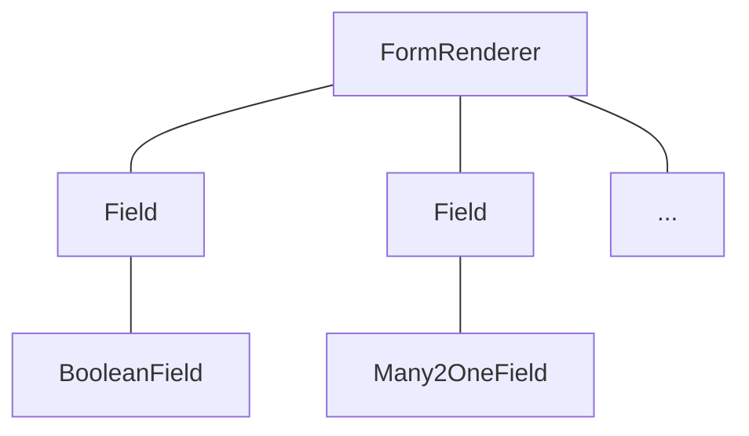

# Notes: Fields

In the context of the javascript framework, fields are components specialized for
visualizing/editing a specific field for a given record.

For example, a (python) model may define a boolean field, which will be represented
by a field component `BooleanField`.

Usually, fields can display data in `readonly` or in `edit` mode. Also, they are
often specific to a field type: `boolean`, `float`, `many2one`, ...

Fields have to be registered in the `fields` registry. Once it's done, they can
be used in some views (namely: `form`, `list`, `kanban`) by using the `widget`
attribute:

```xml
    <field name="preview_moves" widget="account_resequence_widget"/>
```

Note that fields may in some case be used outside the context of a view.

## Generic Field Component

Just like concrete views are designed to be created by a generic `View` component,
concrete fields are also designed to be created by a generic component, `Field`.

For example:

```xml
<Field
    name="field.name"
    record="props.record"
    type="field.widget"
    readonly="true"
    fieldInfo="props.fieldNodes[field.name]"/>
```

This example show some of the props accepted by the `Field` component. Then, it
will make sure it loads the correct component from the `fields` registry, prepare
the base props, and create its child. Note that the `Field` component is _dom less_:
it only exists as a wrapper for the concrete field instance.

Here is what it look like for the form view:



## Defining a field component

A field component is basically just a component registered in the `fields` registry.
It may define some additional static keys (metadata), such as `displayName` or `supportedTypes`,
and the most important one: `extractProps`, which prepare the base props received
by the `CharField`.

Let us discuss a (simplified) implementation of a `CharField`:

First, here is the template:

```xml
    <t t-name="web.CharField" owl="1">
        <t t-if="props.readonly">
            <span t-esc="formattedValue" />
        </t>
        <t t-else="">
            <input
                class="o_input"
                t-att-type="props.isPassword ? 'password' : 'text'"
                t-att-placeholder="props.placeholder"
                t-on-change="updateValue"
            />
        </t>
    </t>
```

It features a readonly mode, an edit mode, which is an input with a few attributes.
Now, here is the code:

```js
export class CharField extends Component {
  get formattedValue() {
    return formatChar(this.props.value, { isPassword: this.props.isPassword });
  }

  updateValue(ev) {
    let value = ev.target.value;
    if (this.props.shouldTrim) {
      value = value.trim();
    }
    this.props.update(value);
  }
}

CharField.template = "web.CharField";
CharField.displayName = _lt("Text");
CharField.supportedTypes = ["char"];

CharField.extractProps = ({ attrs, field }) => {
  return {
    shouldTrim: field.trim && !archParseBoolean(attrs.password),
    maxLength: field.size,
    isPassword: archParseBoolean(attrs.password),
    placeholder: attrs.placeholder,
  };
};

registry.category("fields").add("char", CharField);
```

There are a few important things to notice:

- the `CharField` receives its (raw) value in props. It needs to format it before displaying it
- it receives a `update` function in its props, which is used by the field to notify
  the owner of the state that the value of this field has been changed. Note that
  the field does not (and should not) maintain a local state with its value. Whenever
  the change has been applied, it will come back (possibly after an onchange) by the
  way of the props.
- it defines an `extractProps` function. This is a step that translates generic
  standard props, specific to a view, to specialized props, useful to the component.
  This allows the component to have a better API, and may make it so that it is
  reusable.

Note that the exact API for fields is not really documented anywhere.
