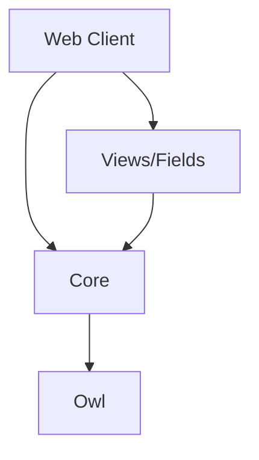

# Notes: The Odoo Javascript Ecosystem

A quick overview

## Historical context

First web client was in Odoo v6.1 (port of a gtk application). Back then,
not many large web applications, so Odoo (then openERP) was built with jquery
and a custom framework (mostly a Class and a Widget implementation). Remember
that it was before Ecmascript 6 (so no class in JS), before bootstrap, before
a lot of the current web technologies.

Then it evolved randomly in a lot of directions. A module system was added in
2014 (maybe some of you will remember `odoo.define(...)`), then the code had to
be improved for the new views, for studio. The complexity of the application
increased a lot, code was getting more structured also.

Then came the need to move to a more modern/productive framework. The Widget system
(based on imperative principles) was not a good bet for the future. Odoo invested
in its own framework (Owl, released in 2019), which is now the basis for the odoo
web client.

2019-2022 has seen a huge amount of work in Odoo JS: the assets system was
modernized (ES6 modules), the codebase was refactored, based on modern architecture
and principles. It involved basically a complete rewrite using owl, services,
registries, components, hooks.

## Odoo 16: A new Era

The v16 is the beginning of a (mostly) completely new codebase. Here is a short
list of most significant changes, in no particular order:

- most of the UI is composed of `Owl` components
- the new code does not use `jquery` anymore (we plan to remove jquery from our assets in the future)
- the `moment` library has been replaced by `luxon` (to manipulate date/datetime)
- we now use `bootstrap` 5, but only the layout and css (not using the js code if possible)
- with Owl, we don't need to add much css classes (it was necessary before to target event handlers, but can
  now be done with `t-on-click` in templates)
- assets (js/css/xml) are now declared in the manifest, can be easily split in
  bundles, and js files can use ES6 syntax
- code is now organized by feature, not by type. So, we no longer have folders like
  `css`, `js`, `xml`. Instead, we organize files and folders according to their
  function (`reporting`, `notifications`, ...)

## Backend or frontend?

Roughly speaking, Odoo has 3 main javascript codebases:


- the website (public, also known in odoo as the `frontend`)
- the webclient (private, also known as the `backend` (to be avoided, since it is confusing))
- the point of sale

The website is a classical MPA (Multi Page Application). Each page is rendered
by the server. It will load some javascript to add a touch of life to the UI.

The webclient and the point of sale are SPA (Single Page Application). The (only)
page is rendered by the browser. It will then loads data from the server, as
needed, and update the page without reloading the page.

Since they are based on very different principles, the code of website is very
different from the code of the web client/point of sale (even though they share
some code, mostly in `addons/web/static/src/core`). This training will be
more focused on the SPA aspect of Odoo.

## The different layers of Odoo Javascript in Odoo

One can think of the Odoo web client as being built with four layers:



- `web client`: it is the presentation layer that describes the
  user interface (navbar, action system, ...)
- `views and fields`: all the code that describes how to visualize and interact with data
  from the database, such as the form view, the list view or the kanban view.
- `core`: it is the layer that defines the basic building blocks
  for an odoo application. Things such as `registries`, `services`, helpers,
  python engine, generic components.
- `owl`: the low level component system. It defines the basic
  primitives for writing UI code, such as the Component or the `reactive` function.

## Folder structure

Most of the time, javascript (and other assets) code should be structured like
this:

```
/static/
    src/
        notifications/
            notification_service.js
            notification.js
            notification.xml
            notification.scss
        some_component.js
        some_component.xml
        ...
    tests/
        helpers.js
        notification_tests.js
        ...
```

Note that we don't have the `js/`, `scss`, or `xml` folder anymore. Code is
grouped by concern. Tests should be located in a `static/tests` folder.
