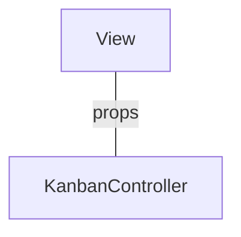
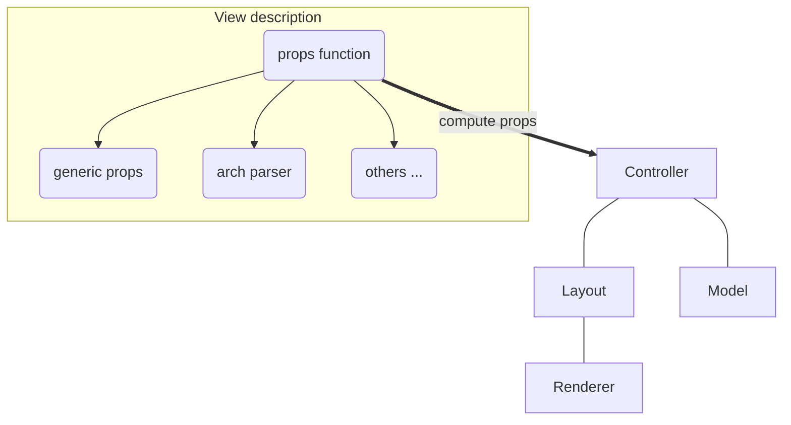

# Notes: Views

Views are among the most important components in Odoo: they allow users to interact
with their data. Let us discuss how Odoo views are designed.

The power of Odoo views is that they declare how a particular screen should work,
with a xml document (usually named `arch`, short for `architecture`). This description
can be extended/modified by xpaths serverside. Then the browser will load that
document, parse it (fancy word to say that it will extract the useful information),
then represent the data accordingly.

The `arch` document is view specific. For example, here is how a `graph` view
or a `calendar` view could be defined:

```xml
  <graph string="Invoices Analysis" type="line" sample="1">
      <field name="product_categ_id"/>
      <field name="price_subtotal" type="measure"/>
  </graph>

  <calendar string="Leads Generation" create="0" mode="month" date_start="activity_date_deadline" color="user_id" hide_time="true" event_limit="5">
    <field name="expected_revenue"/>
    <field name="partner_id" avatar_field="avatar_128"/>
    <field name="user_id" filters="1" invisible="1"/>
</calendar>
```

## The generic `View` component

Most of the time, views are created with the help of a generic `View` component,
located in `@web/views/view`. For example, here is what it look like for a kanban view:



The `View` component is responsible for many tasks:

- loading the view arch description from the server
- loading the search view description, if necessary
- loading the active filters
- if there is a `js_class` attribute on the root node of the arch, get the
  correct view from the view registry
- creating a searchmodel (that manipulates the current domain/context/groupby/facets)

## Defining a javascript view

A view is defined in the view registry by an object with a few specific keys.

- `type`: the (base) type of a view (so, for example, `form`, `list`, ...)
- `display_name`: what shoul be displayed in tooltip in the view switcher
- `icon`: what icon to use in the view switcher
- `multiRecord`: if the view is supposed to manage 1 or a set of records
- `Controller`: the most important information: the component that will be used
  to render the view.

Here is a minimal `Hello` view, which does not display anything:

```js
/** @odoo-module */

import { registry } from "@web/core/registry";

export const helloView = {
  type: "hello",
  display_name: "Hello",
  icon: "fa fa-picture-o",
  multiRecord: true,
  Controller: Component,
};

registry.category("views").add("hello", helloView);
```

## The Standard View Architecture

Most (or all?) odoo views share a common architecture:



The view description can define a `props` function, which receive the standard
props, and compute the base props of the concrete view. The `props` function is
executed only once, and can be thought of as being some kind of factory. It is
useful to parse the `arch` xml document, and to allow the view to be parameterized
(for example, it can return a Renderer component that will be used as Renderer),
but then it makes it easy to customize the specific renderer used by a sub view.

Note that these props will be extended before being given to the Controller. In
particular, the search props (domain/context/groupby) will be added.

Then the root component, commonly called the `Controller`, coordinates everything.
Basically, it uses the generic `Layout` component (to add a control panel),
instantiates a `Model`, and uses a `Renderer` component in the `Layout` default
slot. The `Model` is tasked with loading and updating data, and the `Renderer`
is supposed to handle all rendering work, along with all user interactions.

### Parsing an arch

The process of parsing an arch (xml document) is usually done with a `ArchParser`,
specific to each view. It inherits from a generic `XMLParser` class. For example,
it could look like this:

```js
import { XMLParser } from "@web/core/utils/xml";

export class GraphArchParser extends XMLParser {
  parse(arch, fields) {
    const result = {};
    this.visitXML(arch, (node) => {
        ...
    });
    return result;
  }
}
```
